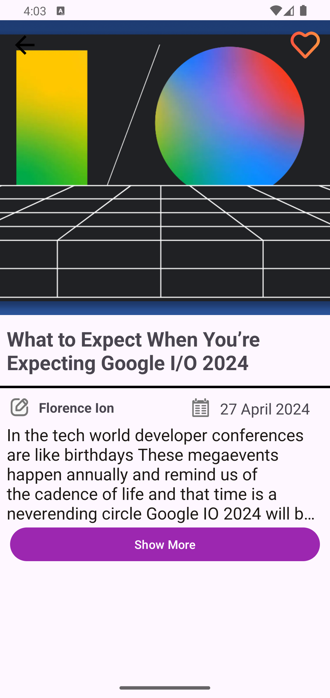

# News App with Paging3
## About the Application
This application harnesses the power of modern Android technologies to deliver a seamless and engaging user experience. Upon launching the application, users are presented with a meticulously curated list of news articles, powered by the robust Paging3 library. The application leverages the Gemini API to provide users with detailed news articles, sources, and comprehensive summaries. Furthermore, it offers a personalized experience by allowing users to bookmark their favorite news articles for offline access. This feature-rich application is designed to keep users informed and engaged, making it a reliable companion for those who want to stay updated with the latest news.

&nbsp; &nbsp; &nbsp;
&nbsp; 

## Kullanılan Teknolojiler
- Kotlin
- MVVM (Model, View, ViewModel) Architecture
- Paging3 Library
- Retrofit [News API](https://newsapi.org/) - [Gemini API](https://ai.google.dev/gemini-api?hl=tr)
- Flow
- Coroutine
- SOLID Principles
- Android Jetpack (Navigation, LiveData, ViewModel, Room Database)
- Hilt Dependency Injection
- Fragment
- View Binding
- Recycler View
- Material Design Components
- Singleton Design Pattern
